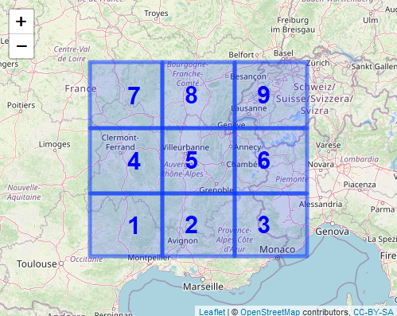

Find pooling region
================

### Example on how to use the package to find possible pooling region for precipitation extremes. 

``` r
library(findpoolreg)
library(dplyr)
```

## Preliminaries and Model Assumptions

The tests are based on the assumption that the annual/seasonal
precipitation extremes *M*<sub>*d*</sub><sup>(*t*)</sup>, observed at
location *d* in year *t*, follow a generalised extreme value (GEV)
distribution with parameters

```math
\mu_d(t) = \mu_d\exp(\alpha_d c(t)/\mu_d), \
\sigma_d(t) = \sigma_d\exp(\alpha_d c(t)/\mu_d), \
\gamma_d(t) \equiv \gamma_d
```
Here, *c*(*t*) denotes the global mean surface temperature anomaly in year t.
The parameter vector is thus
**ϑ**<sub>*d*</sub> = (*μ*<sub>*d*</sub>, *σ*<sub>*d*</sub>, *γ*<sub>*d*</sub>, *α*<sub>*d*</sub>)<sup>⊤</sup>.
The null-hypothesis that is tested is for a given set of locations *A*
with \|*A*\| ≥ 2 is
*H*<sub>0</sub>(*A*):  ∃ **ϑ**<sub>*A*</sub> ∈ (0, ∞)<sup>2</sup> × ℝ<sup>2</sup>: ∀ *d* ∈ *A*:  **ϑ**<sub>*d*</sub> = **ϑ**<sub>*A*</sub>.
Therefore, whenever the test rejects the null-hypothesis for a pair, the
pair can be considered as not homogeneous and observations from the
respective locations should not be pooled to a larger sample.

## Application of bootstrap procedure

We are going to apply the bootstrap procedures on the example data set
contained in this package. Note that the example data set is a simulated
data set, with parameters

    #>   Location mu sigma gamma alpha
    #> 1        1 23     6  0.12   3.0
    #> 2        2 23     6  0.10   3.0
    #> 3        3 22     6  0.15   3.0
    #> 4        4 20     5  0.10   2.5
    #> 5        5 20     5  0.10   2.5
    #> 6        6 20     6  0.15   2.5
    #> 7        7 20     5  0.11   2.5
    #> 8        8 20     5  0.10   2.5
    #> 9        9 21     6  0.05   2.5

We therefore have
**ϑ**<sub>4</sub> = **ϑ**<sub>5</sub> = **ϑ**<sub>8</sub>, and
**ϑ**<sub>7</sub> deviates only very slightly.

First, we load the data and grid coordinates.

``` r
data("example_grid")
data("example_data")
head(example_grid)
#> # A tibble: 6 x 7
#>   Region from_lat from_lon to_lon to_lat meanlon meanlat
#>    <int>    <dbl>    <dbl>  <dbl>  <dbl>   <dbl>   <dbl>
#> 1      1     43.8     2.25   4.25   45      3.25    44.4
#> 2      2     43.8     4.25   6.25   45      5.25    44.4
#> 3      3     43.8     6.25   8.25   45      7.25    44.4
#> 4      4     45       2.25   4.25   46.2    3.25    45.6
#> 5      5     45       4.25   6.25   46.2    5.25    45.6
#> 6      6     45       6.25   8.25   46.2    7.25    45.6
head(example_data)
#>             1        2        3        4        5        6        7        8        9
#> [1,] 32.38409 21.49230 38.44668 37.50947 22.06532 29.28567 35.88537 27.67018 17.02165
#> [2,] 22.41256 35.33088 21.19314 24.43533 21.92437 18.48631 19.31298 14.53100 25.19850
#> [3,] 18.03748 23.29668 37.63637 18.28184 24.79649 20.38750 32.58503 33.16868 16.04230
#> [4,] 34.07392 25.40644 29.92999 20.64297 16.45135 19.39739 17.59839 15.53414 25.46021
#> [5,] 22.15804 23.60167 34.93844 18.39849 17.84227 33.41025 20.81810 28.08019 21.20494
#> [6,] 26.67520 33.18655 21.74208 22.83131 23.42914 16.72051 23.52937 24.22438 12.64835
```

We can have a look at the grid to get an impression of the region.

``` r
leaflet::leaflet(data = example_grid, width = 500, height = 400)  %>% 
  leaflet::addTiles() %>%
  leaflet::addRectangles(lng1 = ~from_lon, lng2 = ~to_lon, lat1 = ~from_lat, lat2 = ~to_lat) %>% 
  leaflet::addLabelOnlyMarkers(~meanlon, ~meanlat, label =  ~as.character(Region), 
                               labelOptions = leaflet::labelOptions(noHide = TRUE, textOnly = TRUE,
                               textsize = 5, style = list("color" = "blue",  "font-weight" = "bold", 
                                                          "font-size" = "30px")))
```

<!-- -->

Now, let’s assume we want to find all regions for which the parameters
of the scale-GEV distribution seem sufficiently similar to those of the
region with the label 5. To do so, we first apply the bootstrap
procedure based on max-stable processes to all pairs
(5, *d*), *d* = 1, …, 4, 6, …, 9. We first make a list containing all
those pairs and get values of the temporal covariate (here: 4-year
smoothed GMST anomaly). For this, we assume that our data are
observations from Years 1947 to 2021. Also, we check whether the column
names of the data matrix are those used when defining the pairs
(i.e. numbered from 1 to 9).

``` r
colnames(example_data)
#> [1] "1" "2" "3" "4" "5" "6" "7" "8" "9"
subsets <- purrr::map(c(1:4, 6:9), ~ c(5, .x))
subsets[1:2]  # first two subsets
#> [[1]]
#> [1] 5 1
#> 
#> [[2]]
#> [1] 5 2
cvrt <- (findpoolreg::GMST %>% dplyr::filter(Year >= 1947, Year <= 2021))$smoothedGMST
```

Further, we need to assemble the centre points of the grid tiles in a
matrix. As we can see, the centers are already contained in the grid
data in the correct order, so we only transform the relevant columns to
a matrix

``` r
head(example_grid)
#> # A tibble: 6 x 7
#>   Region from_lat from_lon to_lon to_lat meanlon meanlat
#>    <int>    <dbl>    <dbl>  <dbl>  <dbl>   <dbl>   <dbl>
#> 1      1     43.8     2.25   4.25   45      3.25    44.4
#> 2      2     43.8     4.25   6.25   45      5.25    44.4
#> 3      3     43.8     6.25   8.25   45      7.25    44.4
#> 4      4     45       2.25   4.25   46.2    3.25    45.6
#> 5      5     45       4.25   6.25   46.2    5.25    45.6
#> 6      6     45       6.25   8.25   46.2    7.25    45.6
grid_centers <- as.matrix(example_grid[ , c("meanlon", "meanlat")])
```

Now we are ready to the function `bootstrap_scalegev_subsets`, which is
the one that performs the max-stable-process-based bootstrap procedure.

``` r
set.seed(1)
bootres <- bootstrap_scalegev_subsets(data = example_data, temp.cov = cvrt,
                                      locations = grid_centers, subsets = subsets, B = 500)
bootres
#> # A tibble: 8 x 10
#>   teststat        p  p_boot bootstrap.B Model_Sel ms_pars   par_h0    H0       X1    X2
#>      <dbl>    <dbl>   <dbl>       <dbl> <chr>     <list>    <list>    <chr> <dbl> <dbl>
#> 1    16.6  2.34e- 3 0.0120          500 gauss     <dbl [3]> <dbl [4]> ED        5     1
#> 2    66.5  1.24e-13 0               500 gauss     <dbl [3]> <dbl [4]> ED        5     2
#> 3    31.4  2.50e- 6 0               500 gauss     <dbl [3]> <dbl [4]> ED        5     3
#> 4     2.63 6.22e- 1 0.683           500 gauss     <dbl [3]> <dbl [4]> ED        5     4
#> 5    18.8  8.58e- 4 0.00599         500 gauss     <dbl [3]> <dbl [4]> ED        5     6
#> 6     6.71 1.52e- 1 0.261           500 gauss     <dbl [3]> <dbl [4]> ED        5     7
#> 7     6.72 1.51e- 1 0.228           500 gauss     <dbl [3]> <dbl [4]> ED        5     8
#> 8    17.5  1.56e- 3 0.0160          500 gauss     <dbl [3]> <dbl [4]> ED        5     9
```

Once the bootstrapped p-values are computed, we can compute adjusted
p-values with the function `get_adj_pvals`. Here, we choose the
Benjamini Hochberg and the Benjamini Yekutieli methods for adjusting the
p-values.

``` r
bootres <- get_adj_pvals(bootres, methods = c("BH", "BY"))
bootres %>% dplyr::arrange(p_boot)
#> # A tibble: 8 x 12
#>   teststat        p  p_boot bootstrap.B Model_Sel ms_pars   par_h0    H0       X1    X2   p_by   p_bh
#>      <dbl>    <dbl>   <dbl>       <dbl> <chr>     <list>    <list>    <chr> <dbl> <dbl>  <dbl>  <dbl>
#> 1    66.5  1.24e-13 0               500 gauss     <dbl [3]> <dbl [4]> ED        5     2 0      0     
#> 2    31.4  2.50e- 6 0               500 gauss     <dbl [3]> <dbl [4]> ED        5     3 0      0     
#> 3    18.8  8.58e- 4 0.00599         500 gauss     <dbl [3]> <dbl [4]> ED        5     6 0.0434 0.0160
#> 4    16.6  2.34e- 3 0.0120          500 gauss     <dbl [3]> <dbl [4]> ED        5     1 0.0651 0.0240
#> 5    17.5  1.56e- 3 0.0160          500 gauss     <dbl [3]> <dbl [4]> ED        5     9 0.0694 0.0255
#> 6     6.72 1.51e- 1 0.228           500 gauss     <dbl [3]> <dbl [4]> ED        5     8 0.812  0.299 
#> 7     6.71 1.52e- 1 0.261           500 gauss     <dbl [3]> <dbl [4]> ED        5     7 0.812  0.299 
#> 8     2.63 6.22e- 1 0.683           500 gauss     <dbl [3]> <dbl [4]> ED        5     4 1      0.683
```

We can also plot the grid tiles shaded in the colours of the respective
p-values, with the function `visualise_test_res`. The method for
adjusting p-values is provided in the argument method.

``` r
visualise_test_res(coord_grid = example_grid, testres = bootres, method = "BH",
                   plot_type = "pvals", level = 0.1, Zoom = 2, position = "topright",
                   width = 800, height = 400)
```

<!-- -->
